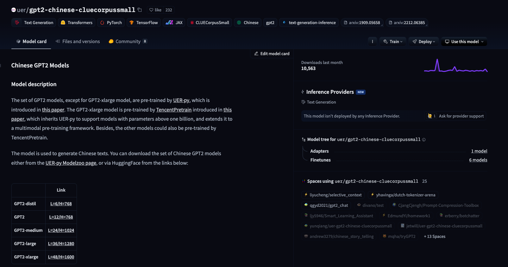

# HuggingFace 大模型使用

测试模型：`uer/gpt2-chinese-cluecorpussmall`
模型地址：https://huggingface.co/uer/gpt2-chinese-cluecorpussmall




**API 方式调用（极其不推荐）**

```python
import requests

# declare model request url
API_URL = "https://api-inference.huggingface.co/models/uer/gpt2-chinese-cluecorpussmall"
# declare model request token
API_TOKEN = "Your HuggingFace Token"

# declare the request headers
headers = {"Authorization": f"Bearer {API_TOKEN}"}

# huggingface api request
response = requests.post(
    API_URL, headers=headers, json={"input": "你好，HuggingFace"}
)

print(response)
```


**本地环境运行（下载模型到本地环境运行）**

```python
from transformers import AutoModelForCausalLM, AutoTokenizer

# 将模型和分词器下载到本地，并指定保存路径
model_name = "uer/gpt2-chinese-cluecorpussmall"

# 本地缓存路径
cache_dir = "/Users/krian/PycharmProjects/llm-study/01-API-HuggingFace/model/uer/gpt2-chinese-cluecorpussmall"

# 下载大模型（默认存储本地路径：～/.cache/huggingface/hub）
AutoModelForCausalLM.from_pretrained(model_name, cache_dir=cache_dir)
# 下载分词器
AutoTokenizer.from_pretrained(model_name, cache_dir=cache_dir)

print(f"模型分词器已经下载到：{cache_dir}")
```

- 默认本地下载缓存路径：`～/.cache/huggingface/hub`

- `config.json` 模型配置文件

```
# 分词器（Bert模型）
"tokenizer_class": "BertTokenizer",

# 识别文字字符数量（字典数量）
"vocab_size": 21128
```

- `special_tokens_map.json` 配置模型特殊字符

```
{"unk_token": "[UNK]", "sep_token": "[SEP]", "pad_token": "[PAD]", "cls_token": "[CLS]", "mask_token": "[MASK]"}
```

- `tokenizer_config.json` 分词配置
- `vocab.txt` 模型能识别的字符集


**本地文件调用缓存模型：**

```python
from transformers import AutoModelForCausalLM, AutoTokenizer, Pipeline, pipeline

# 指定模型本地缓存路径（指定到config.json所在的文件目录的绝对路径）
model_dir = "/Users/krian/PycharmProjects/llm-study/01-API-HuggingFace/model/uer/gpt2-chinese-cluecorpussmall/models--uer--gpt2-chinese-cluecorpussmall/snapshots/c2c0249d8a2731f269414cc3b22dff021f8e07a3"

# 加载模型文件
model = AutoModelForCausalLM.from_pretrained(model_dir)
# 加载分词器
tokenizer = AutoTokenizer.from_pretrained(model_dir)

# 配置pipeline，处理文本生成
generator = pipeline("text-generation", model=model, tokenizer=tokenizer, device="cpu")

# 执行文本生成
outputs = generator("你好，我是一款大语言模型", max_length=256, num_return_sequences=1)

print(outputs)
```

**大模型生成配置参数：**

- `num_return_sequences` ：
- 


BERT 模型：句子分类（情感分析、文本分类）

GPT 模型：文本生成（写文章、对话系统）

**BERT 分类模型：**

```python
from transformers import BertTokenizer, BertForSequenceClassification, pipeline

model_dir = r"model/bert-base-chinese"

# 下载模型和分词器（如果配置了模型名，会先访问HuggingFace，然后判断本地目录是否存在模型文件，决定是否下载）
model = BertForSequenceClassification.from_pretrained("bert-base-chinese", cache_dir=model_dir)
tokenizer = BertTokenizer.from_pretrained("bert-base-chinese", cache_dir=model_dir)

# 创建pipline
classifier = pipeline("text-classification", model=model, tokenizer=tokenizer, device="cpu")

# 进行文件文本分类
result = classifier("你好，我是一个大语言模型")

# 输出模型分类结构
print(result)

# 输出模型结构
print(model)
```

控制台输出：

```
[{'label': 'LABEL_1', 'score': 0.6435019969940186}]
```


**BERT 模型结构：**

```
BertForSequenceClassification(
  (bert): BertModel(
    (embeddings): BertEmbeddings(
      (word_embeddings): Embedding(21128, 768, padding_idx=0)
      (position_embeddings): Embedding(512, 768)
      (token_type_embeddings): Embedding(2, 768)
      (LayerNorm): LayerNorm((768,), eps=1e-12, elementwise_affine=True)
      (dropout): Dropout(p=0.1, inplace=False)
    )
    (encoder): BertEncoder(
      (layer): ModuleList(
        (0-11): 12 x BertLayer(
          (attention): BertAttention(
            (self): BertSdpaSelfAttention(
              (query): Linear(in_features=768, out_features=768, bias=True)
              (key): Linear(in_features=768, out_features=768, bias=True)
              (value): Linear(in_features=768, out_features=768, bias=True)
              (dropout): Dropout(p=0.1, inplace=False)
            )
            (output): BertSelfOutput(
              (dense): Linear(in_features=768, out_features=768, bias=True)
              (LayerNorm): LayerNorm((768,), eps=1e-12, elementwise_affine=True)
              (dropout): Dropout(p=0.1, inplace=False)
            )
          )
          (intermediate): BertIntermediate(
            (dense): Linear(in_features=768, out_features=3072, bias=True)
            (intermediate_act_fn): GELUActivation()
          )
          (output): BertOutput(
            (dense): Linear(in_features=3072, out_features=768, bias=True)
            (LayerNorm): LayerNorm((768,), eps=1e-12, elementwise_affine=True)
            (dropout): Dropout(p=0.1, inplace=False)
          )
        )
      )
    )
    (pooler): BertPooler(
      (dense): Linear(in_features=768, out_features=768, bias=True)
      (activation): Tanh()
    )
  )
  (dropout): Dropout(p=0.1, inplace=False)
  (classifier): Linear(in_features=768, out_features=2, bias=True)
)
```

- `embeddings` ：把离散的输入 token 转换成稠密向量，并注入位置信息和句子类型信息，作为 Transformer 编码器的输入。
- `encoder` ：通过多层自注意力机制，逐层抽取深层语义特征，让每个词的表示不仅包含自身含义，还融合上下文语境。
- `pooler` ：把整个句子编码为一个固定长度的向量表示（相当于句子级语义摘要）。
- `dropout` ：减少过拟合，提升模型泛化能力。
- `classifier` ：将句子向量映射到具体任务的标签空间（分类任务）。


模型输出的始终是一个概率值！


