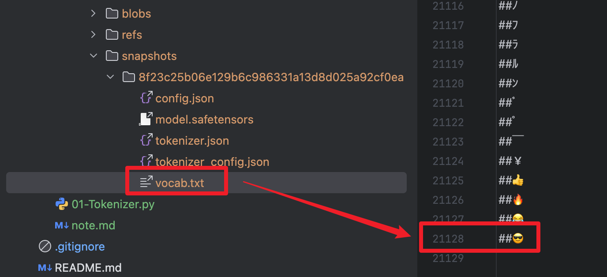
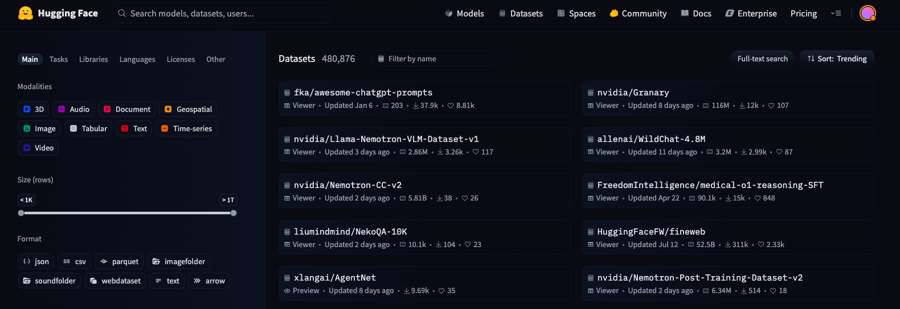
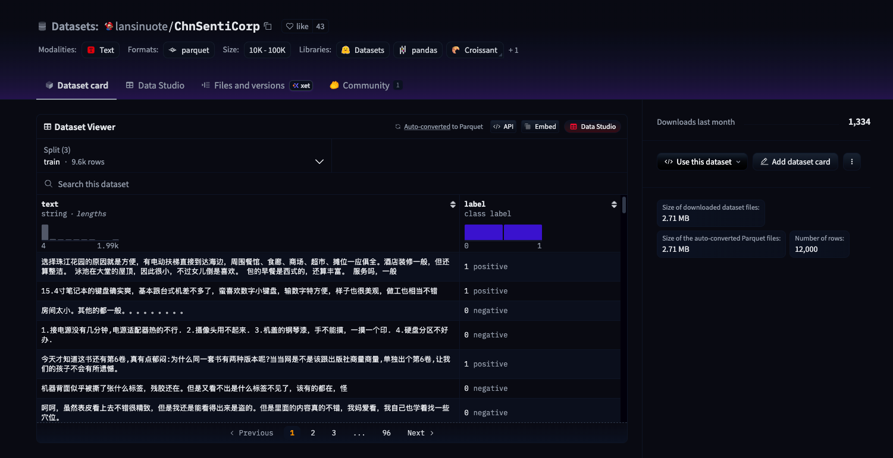
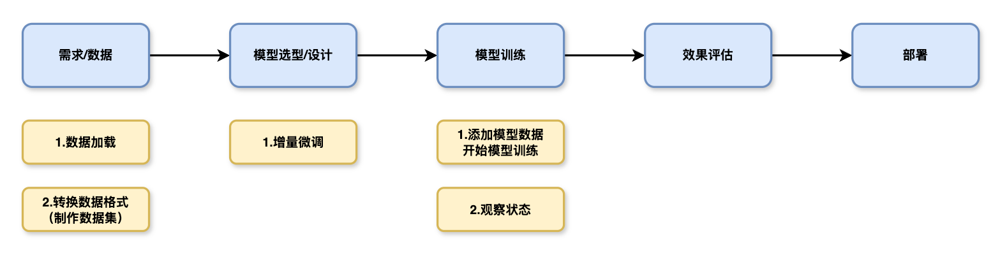
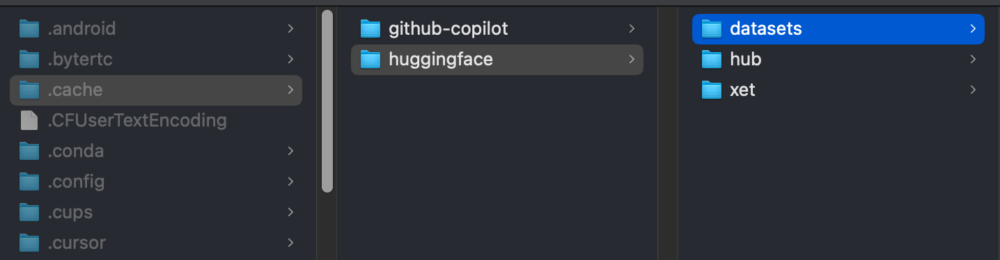
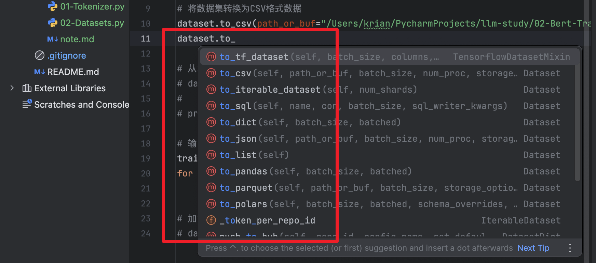

# Bert 模型微调

中文评论分析模型的本地训练与测试

1. 使用 Tokenizer 实现字符编码，vocab 字典操作
2. 模型微调的基本概念
3. 下游任务设计（模型增量微调）
4. 自定义模型训练与效果评估


---

## AI 模型如何处理字符数据

所有深度学习模型本质上都是矩阵。


```python
from transformers import BertTokenizer

# 加载分词器
tokenizer = BertTokenizer.from_pretrained("/Users/krian/PycharmProjects/llm-study/02-Bert-Train/model/bert-base-chinese/models--bert-base-chinese/snapshots/8f23c25b06e129b6c986331a13d8d025a92cf0ea")

print(tokenizer)
```

控制台输出：

```
BertTokenizer(name_or_path='/Users/krian/PycharmProjects/llm-study/02-Bert-Train/model/bert-base-chinese/models--bert-base-chinese/snapshots/8f23c25b06e129b6c986331a13d8d025a92cf0ea', vocab_size=21128, model_max_length=512, is_fast=False, padding_side='right', truncation_side='right', special_tokens={'unk_token': '[UNK]', 'sep_token': '[SEP]', 'pad_token': '[PAD]', 'cls_token': '[CLS]', 'mask_token': '[MASK]'}, clean_up_tokenization_spaces=True, added_tokens_decoder={
	0: AddedToken("[PAD]", rstrip=False, lstrip=False, single_word=False, normalized=False, special=True),
	100: AddedToken("[UNK]", rstrip=False, lstrip=False, single_word=False, normalized=False, special=True),
	101: AddedToken("[CLS]", rstrip=False, lstrip=False, single_word=False, normalized=False, special=True),
	102: AddedToken("[SEP]", rstrip=False, lstrip=False, single_word=False, normalized=False, special=True),
	103: AddedToken("[MASK]", rstrip=False, lstrip=False, single_word=False, normalized=False, special=True),
}
)
```

- `vocab_size=21128` ：模型识别字符数（模型识别的字符数是有限的）




**Token 编码：**

```python
from transformers import BertTokenizer

# 加载分词器
tokenizer = BertTokenizer.from_pretrained("/Users/krian/PycharmProjects/llm-study/02-Bert-Train/model/bert-base-chinese/models--bert-base-chinese/snapshots/8f23c25b06e129b6c986331a13d8d025a92cf0ea")

# 输出分词器结构
# print(tokenizer)

# 定义一个句子文本集合
sentences = [
    "白日依山尽",
    "价格在这个地方适中，附近有早餐店，比较方便，地理位置好"
]

# 批量进行句子解码
out = tokenizer.batch_encode_plus(
    batch_text_or_text_pairs=[sentences[0], sentences[1]],
    add_special_tokens=True,
    # 当句子的长度大于max_length时进行句子截断
    truncation=True,
    # 设置句子的最大长度，上限是模型能处理的最大长度：model_max_length
    max_length=6,
    # 当句子的长度小于max_length时，一律补0
    padding="max_length",
    # 设置编码的返回类型（可取值：tf，pt，np，默认List（None））
    return_tensors=None,
    # 模型返回值
    return_attention_mask=True,
    return_token_type_ids=True,
    return_special_tokens_mask=True,
    # 返回编码后的序列长度
    return_length=True,
)

# input_ids：编码后序列
# token_type_ids：第一个句子和特殊符号的位置是0，第二句子的位置1（只针对上下文编码）
# special_tokens_mask：特殊符号位置为1，其他位置为0
# length：编码后的序列长度
for k,v in out.items():
    print(k, ": ", v)
```

控制台输出：

```
input_ids :  [[101, 4635, 3189, 898, 2255, 102], [101, 817, 3419, 1762, 6821, 102]]
token_type_ids :  [[0, 0, 0, 0, 0, 0], [0, 0, 0, 0, 0, 0]]
special_tokens_mask :  [[1, 0, 0, 0, 0, 1], [1, 0, 0, 0, 0, 1]]
length :  [6, 6]
attention_mask :  [[1, 1, 1, 1, 1, 1], [1, 1, 1, 1, 1, 1]]
```


**Token 解码：**

```python
# 解码文本
input_0 = tokenizer.decode(out["input_ids"][0])
input_1 = tokenizer.decode(out["input_ids"][1])

print(input_0, "\n", input_1)
```

控制台输出：

```
[CLS] 白 日 依 山 [SEP] 
[CLS] 价 格 在 这 [SEP]
```


---

## 数据获取

HuggingFace 数据集：https://huggingface.co/datasets



- 选择的数据集：`lansinuote/ChnSentiCorp`
- 数据集地址：https://huggingface.co/datasets/lansinuote/ChnSentiCorp




## 模型训练



**在线加载数据集：**

```python
from datasets import load_dataset

# 在线加载数据集
dataset = load_dataset(path="lansinuote/ChnSentiCorp")

print(dataset)

# 输出数据集内容
train_data = dataset["train"]
for data in train_data:
    print(data)
```

>  PS：从`hugging face` 上下载的文件默认存储在当前登录用户的家目录下的 `.cahce` 目录下的 `huggingface` 目录中。
>
> 可以使用 `cache_dir` 参数指定数据缓存路径。




**从本地磁盘加载数据：**

```python
# 从本地缓存中加载数据
dataset = load_from_disk("指定本地数据存储路径")

print(dataset)
```

从磁盘加载 CSV 格式数据：

```python
# 加载CSV格式数据
dataset = load_dataset(path="csv", data_files="指定CSV文件存储绝对路径")
```

将 HuggingFace 上的加密数据集进行数据类型转换：

```python
# 将数据集转换为CSV格式数据
dataset.to_csv(path_or_buf="/Users/krian/PycharmProjects/llm-study/02-Bert-Train/dataset/ChnSentiCorp")
```




**输出数据集信息：**

```
DatasetDict({
    train: Dataset({
        features: ['text', 'label'],
        num_rows: 9600
    })
    validation: Dataset({
        features: ['text', 'label'],
        num_rows: 1200
    })
    test: Dataset({
        features: ['text', 'label'],
        num_rows: 1200
    })
})
```


**制作数据集：**

```python
from datasets import load_dataset
from torch.utils.data import Dataset


class MyDataset(Dataset):

    """
    定义初始化自定义数据集
    """
    def __init__(self, split):
        # 加载缓存数据集
        self.dataset = load_dataset(path="lansinuote/ChnSentiCorp",
                               cache_dir="/Users/krian/PycharmProjects/llm-study/02-Bert-Train/dataset/ChnSentiCorp")

        if split == "train":
            self.dataset = self.dataset["train"]
        elif split == "test":
            self.dataset = self.dataset["test"]
        elif split == "validation":
            self.dataset = self.dataset["validation"]
        else:
            print("Invalid split")


    """
    获取数据集长度 
    """
    def __len__(self):
        return len(self.dataset)

    """
    获取数据
    """
    def __getitem__(self, item):
        # 获取数据集中的元素
        text = self.dataset[item]["text"]
        label = self.dataset[item]["label"]

        return text, label


# 测试输出
if __name__ == '__main__':
    dataset = MyDataset("test")

    for text, label in dataset:
        print(text, label)
```


**定义下游任务模型结构：**

```python
import torch
from transformers import BertModel

# 定义设备信息
DEVICE = torch.device("cuda" if torch.cuda.is_available() else "cpu")
print(DEVICE)

# 加载预训练模型
predict_model = BertModel.from_pretrained("/Users/krian/PycharmProjects/llm-study/02-Bert-Train/model/bert-base-chinese/models--bert-base-chinese/snapshots/8f23c25b06e129b6c986331a13d8d025a92cf0ea")

print(predict_model)


# 定义下游任务（增量模型）
class Model(torch.nn.Module):

    """
    设计模型结构
    """
    def __init__(self):
        super().__init__()

        # 设计全链接网络，实现二分类任务
        self.fc = torch.nn.Linear(768, 2)


    """
    使用模型处理数据（执行前向计算）
    """
    def forward(self, input_ids, attention_mask, token_type_ids):
        # 冻结Bert模型的参数，使其不参与训练
        with torch.no_grad():
            out = predict_model(input_ids=input_ids, attention_mask=attention_mask, token_type_ids=token_type_ids)

        # 增量模型参与训练
        out = self.fc(out.last_hidden_state[:, 0])

        return out
```


