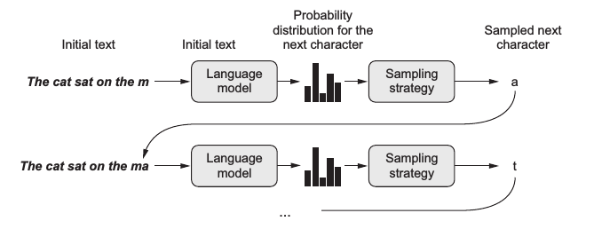

在任何AI训练中，批次越大越好（模型的训练速度会更快，训练效果会更好）


`Windows` 查看 `GPU` 使用信息：

```shell
pip install nvitop
```


样本是为进行标注出来的！AI 对于数据的要求是质量而不是数量！

数据集切分比例：7（train）：2（test）：1（val）


---

**生成式模型是如何进行生成的？？？**

模型进行文本续写：`text_generator("这是很久之前的事情了,", max_length=100, do_sample=False)` 

任何的生成模型都需要输入一个提示词（ `Prompt` ），默认都有一个生成的最大长度 `max_length` 

模型输出层结构：`(lm_head): Linear(in_features=768, out_features=21128, bias=False)` 这里可以看到 `out_features` 是21128（字符概率），即输出的对应的字符。

在进行生成时，进行增量迭代。每输出一个 Token，模型就进行一次增量运算（之前的输入 + 之前模型的输出 -> 作为新的模型输入）。



`GPT2LMHeadModel` 模型结构：

```
GPT2LMHeadModel(
  (transformer): GPT2Model(
    (wte): Embedding(21128, 768)
    (wpe): Embedding(1024, 768)
    (drop): Dropout(p=0.1, inplace=False)
    (h): ModuleList(
      (0-11): 12 x GPT2Block(
        (ln_1): LayerNorm((768,), eps=1e-05, elementwise_affine=True)
        (attn): GPT2Attention(
          (c_attn): Conv1D(nf=2304, nx=768)
          (c_proj): Conv1D(nf=768, nx=768)
          (attn_dropout): Dropout(p=0.1, inplace=False)
          (resid_dropout): Dropout(p=0.1, inplace=False)
        )
        (ln_2): LayerNorm((768,), eps=1e-05, elementwise_affine=True)
        (mlp): GPT2MLP(
          (c_fc): Conv1D(nf=3072, nx=768)
          (c_proj): Conv1D(nf=768, nx=3072)
          (act): NewGELUActivation()
          (dropout): Dropout(p=0.1, inplace=False)
        )
      )
    )
    (ln_f): LayerNorm((768,), eps=1e-05, elementwise_affine=True)
  )
  (lm_head): Linear(in_features=768, out_features=21128, bias=False)
)
```


**生成模型后处理操作**

`special_tokens_map.json` 特殊字符：

```
{"unk_token": "[UNK]", "sep_token": "[SEP]", "pad_token": "[PAD]", "cls_token": "[CLS]", "mask_token": "[MASK]"}
```

样本长度补齐和截断。当模型生成时，输出一个 `CLS` 时就停止生产了！（对话模版，控制模型生成结构）


PS：做不出竞争力的事情不做，把有限的精力投入到能产生竞争力的事情上！！！